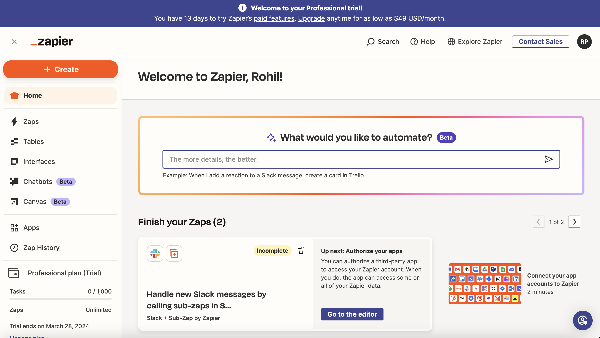
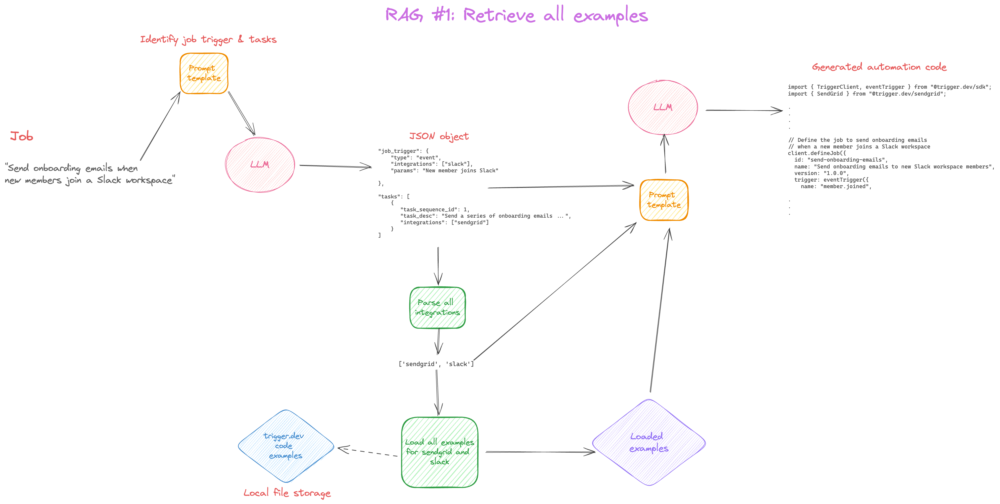
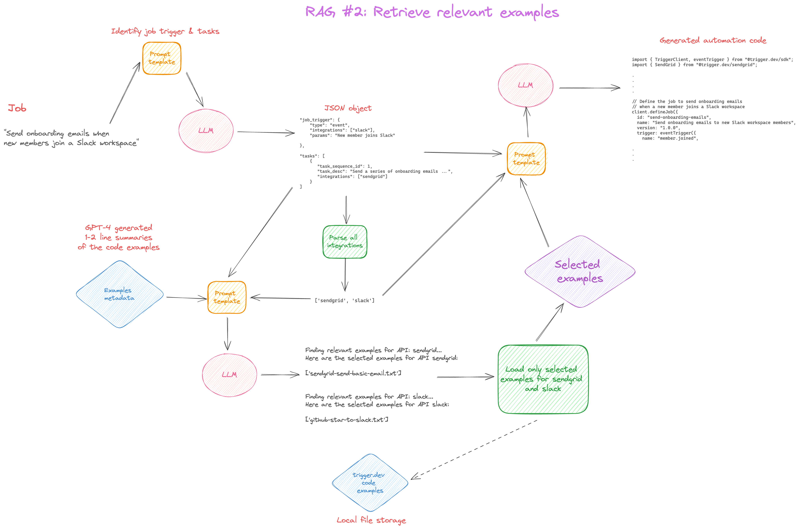

# AutomateLLM

`AutomateLLM` is an attempt to replicate the functionality of Zapier's "Create a Zap with AI" feature.



With this, a user can automate workflows like - 
1. "Send an onboarding email when a new user signs up on my website"
2. "Send a slack reminder notification to all team members who haven't updated their JIRA tickets."

🤩🤩 ***And all this by simply using natural language!!*** 🤩🤩

## Scope

Fully replicating this feature involves multiple moving components and may require several months to implement a production grade version like that of Zapier.

In this project, we will focus on developing the RAG (Retrieval Augmented Generation) pipeline that will try to generate automation code as accurately as possible from a plain english sentence.

## Solution
- To solve this task, we will have to convert an english description of a worflow to its equivalent code. This generated code will be executed by some automation code library and the workflow will be created. For this project, we will use [trigger.dev](https://trigger.dev/).

- We will use GPT-4 (`gpt-4-0125-preview`) as our main LLM to generate the code. But technically, this can be swapped with any other LLM.

- To provided additional context to our LLM, we will retrieve code examples from the [official documentation of Trigger.dev](https://trigger.dev/apis). We demonstrate 2 strategies of example retrieval.

### RAG #1: Retrieve all examples

1. Use a prompt template that takes as input the original job description and generates a JSON string comprising of - 
    - job trigger and its type
    - tasks breakup of the job and the sequence of tasks
    - integrations/third-party APIs required

2. Based on the identified third-party APIs like `gmail`, `slack` etc in step 1, we will retrieve all examples for each identified API. **Note:** The example codes are present as separate .txt files in the folder `integrations/`.

3. **Code generation:** Parse and format the output of steps 1 and 2, pass as inputs to a prompt template and corresponding automation code is generated.

***Limitation:*** Since all the examples for the identified APIs are retrieved, there are chances that we might reach the token limit of the LLM. Since we are using GPT-4 for this demo, the chances of this happening are very rare, but we will have to implement a better approach (look at RAG #2) for LLMs with lower limits.



### RAG #2: Retrieve only relevant examples

1. Step 1 is same as that of RAG #1.

2. Based on the identified third-party APIs like `gmail`, `slack` etc in step 1, we will retrieve only 'relevant' examples for each identified API.
    - For this, we will pre-generate 1-2 line summaries of each example code for all APIs using an LLM (GPT 4)
    - Store these summaries along with other metadata like filename in a JSON file (`datasets/integration_metadata.json`).
    - We will pass this JSON along with the tasks breakdown of the job (obtained in step 1) in a prompt template.
    - This prompt template instructs the LLM to select the examples based on the tasks and the example summaries.

3. **Code generation:** Parse and format the output of steps 1 and 2, pass as inputs to a prompt template and corresponding automation code is generated.



## Files and folders
```
assets/     # images assets for README.md

datasets/   
    create_metadata.py      # script that iterates over all examples
                            # in /integrations directory, 
                            # summarizes each example 
                            # and then aggregates the summaries
                            # as a JSON

    integration_metadata.json     # output of create_metadata.py

integrations/               # trigger.dev example codes
                            # that are used as context
                            # for code generation
  airtable/
    - new-airtable-record-from-typeform.txt
    - integrations/airtable/stripe-sub-update-airtable.txt

  caldotcom/
    - 
    -
  .
  .
  .
  supabase/

tests/
  - test_rag.py         # testing script to test the RAG pipelines for sample inputs

utils/
  - rag_utils.py

.env.example            # example environment file where you must specify your OpenAI API key

Demo.ipynb              # Demo notebook that demonstrates the 2 RAG pipelines

prompt_templates.py     # Very long prompt templates are placed here to make the code readable

rag.py                  # main script where the RAG pipelines are defined

requirements.txt        # Requirements file

schemas.py              # JSON schema used for validating output of step 1 of the RAG pipeline

```

## Next steps

In this version of AutoLLM, we have only used example codes from the trigger.dev documentation.
For more accurate responses, we can parse and embed the complete documentation of trigger.dev in a vector database.

